# Магия
<show-structure for="chapter,procedure" depth="2"/>

## Очки маны

Для сотворения заклинаний нужна энергия, которой обладает каждое живое существо, известная как мана.
Объём маны, в обычных условиях доступный магу для сотворения заклинаний, исчисляется в очках маны (Mana Points, МР).
Чем больше МР у вас есть, тем больше заклинаний вы способны сотворить.
Если у вас не осталось очков маны, вы не можете читать заклинания, пока не восстановите хоть некоторое количество МР.
Маг 1 уровня начинает игру с количеством МР, равным 10 + Магия + 1к6 и получает Магия + 1к6 с каждым новым уровнем (c 11
только значение Магии).
Сильные маги могут творить заклинания долгое время, не истощая свои запасы маны.
Это говорит о том, что очки маны– ресурс не бесконечный, и умный маг знает, когда тратить ману, а когда лучше поберечь.
Каждое заклинание стоит определённое количество очков маны.
Они тратятся каждый раз, когда совершается действие заклинания, вне зависимости от того, получилось сплести чары или
нет.
Магия всегда заставляет платить по счетам.

### Заклинания в броне

Маги могут носить броню, хотя и не обучались этому специально. Однако доспех затрудняет чтение заклинаний: маг вынужден
тратить лишние МР, количество которых зависит от типа брони и её нагрузки. Эта дополнительная мана тратится на каждое
заклинание, так что маг, нацепивший тяжёлую броню, быстро окажется в проигрышном положении.

Таблица соотношения помех и брони 
{collapsible="true"  default-state="collapsed" collapsed-title="Таблица соотношения помех и брони "}
:

| Надета броня         | Нагрузка |
|----------------------|----------|
| Лёгкая кожаная       | 1        |
| Тяжёлая кожаная      | 2        | 
| Лёгкая кольчуга      | 3        | 
| Тяжёлая кольчуга     | 4        | 
| Лёгкая пластинчатая  | 5        | 
| Тяжёлая пластинчатая | 6        | 

### Восстановление очков маны

Маг восстанавливает очки маны после отдыха. За каждый полный час отдыха или медитации вы восстанавливаете 1к6 + Магия
очков маны. Если вы будите отдыхать/медитировать полных 8 часов без перерывов, то вы восстанавливаете ману до максимума.

## Чтение заклинания

Вы можете прочитать любое заклинание, сделав успешный бросок и потратив
соответствующее количество очков маны. Бросок заклинания– обычный бросок
на Магию.

Обычно учитываются фокусы Магии Созидания, Магии Энтропии, Элементальной
Магии и Магии Духа, каждый из которых соответствует одной из магических
школ.

> Бросок заклинания = 3к6 + Магия + фокус (если есть)

Если ваш бросок равен или больше сложности, вы успешно прочитали
заклинание. Если нет, то заклинание проваливается и не действует никак.
Но МР тратятся в любом случае.

При расчете результата некоторых заклинаний используется Кубик Дракона,
так что лучше как-нибудь зафиксируйте выпавшее на нём значение, пока
действие заклинания не прекратится.

### Сила магии

Многие заклинания таковы, что беспокоиться нужно только о броске на заклинание.
Если он успешен, то заклинание работает, как ему положено.
Однако иногда, чтобы заклинание произвело какое-то воздействие, вы должны преодолеть природное сопротивление цели.

Сила Магии– это мощь вашего волшебства; некоторые заклинания позволяют цели (или целям) сделать бросок против Силы Магии, чтобы попытаться воспротивиться действию магии или хотя бы отчасти нейтрализовать его.

> Сила Магии = 10 + Магия + фокус (если есть)

И опять повторим: обычно добавляются фокусы Магии Созидания, Магии Энтропии, Магии Элементов и Магии Духа.
Это означает, что если вы специалист по магии энтропии, то вашим энтропическим заклинаниям тяжелее сопротивляться.

Способность, с помощью которой можно сопротивляться магии, зависит от конкретного заклинания.
В описании каждого заклинания будет указано, нужно ли делать бросок и на какую способность, и каковы последствия его успеха или провала.

### Опасность магии

Когда маг читает заклинание, имеющие требования к изучению и проваливает бросок колдовства, а на Кубике Дракона выпадает 1, происходит провал колдовства (magical mishap).
Провал броска заклинания + 1 на Кубике Дракона = Провал Колдовства Когда происходит провал колдовства, заклинатель должен сразу же сделать другой бросок на Магию (с тем же фокусом) против сложности заклинания.
Удачный бросок означает, что маг просто сбит с ног, как от соответствующего приёма.
Необходимо потратить дополнительное действие на то, чтобы подняться, и противник получает бонус +1 к броскам атаки против упавшего мага.
Маг может потратить столько же маны, сколько требовало провалившееся заклинание, чтобы бросок был автоматически признан успешным.
В таком случае провала колдовства не происходит.
Маг остаётся на ногах, но на заклинание уходит вдвое больше маны, а эффект остаётся нулевым.
Если же этот второй бросок на Магию проваливается, то последствия провала определяются по Кубику Дракона.

Таблица последствий провала заклинаний
{collapsible="true"  default-state="collapsed" collapsed-title="Таблица последствий провала заклинаний"}
:

| Кубик Дракона | Последствия провала                                                                                                                                                                                                                                                                                                                                                                                                   |
|---------------|-----------------------------------------------------------------------------------------------------------------------------------------------------------------------------------------------------------------------------------------------------------------------------------------------------------------------------------------------------------------------------------------------------------------------|
| 1             | Истощение маны (Mana Drain): Маг дополнительно теряет вдвое больше маны, нежели потратил на заклинание (то есть заклинание обходится ему втрое дороже).                                                                                                                                                                                                                                                               |
| 2             | Ожог маны (Mana Burn): Маг теряет количество Здоровья, равное удвоенному количеству маны, потраченному на заклинание.                                                                                                                                                                                                                                                                                                 |
| 3             | Отдача (Backlash): Из-за шока от провала маг не может использовать заклинания в течение 1к6 раундов.                                                                                                                                                                                                                                                                                                                  |
| 4             | Осечка (Misfire): Заклинание действует, но на союзника, а не на врага (или наоборот), или оказывает противоположное воздействие (исцеление вместо причинения урона, или наоборот). Эффект осечки определяется ДМом.                                                                                                                                                                                                   |
| 5             | Потерявшийся в Тени (Lost in the Fade): Маг погружается в транс, в то время как его дух бродит по Тени в течение 2к6 минут. Маг в это время беспомощен и может быть добит ударом милосердия.                                                                                                                                                                                                                          |
| 6             | Истязание (Harrowing): То же самое, что и Потерявшийся в Тени, однако маг также должен каждые две минуты делать бросок на Волю (Веру или Самоконтроль) (Сложность 13) чтобы не пустить демона в своё тело и не превратиться в одержимого. Чем дольше маг пребывает в тени, тем больше опасность. Игровой персонаж, превратившийся в одержимого, попадает под контроль ДМа, а игрок должен заново создавать персонажа. |

## Дерево обучения заклинаний

```mermaid
flowchart LR;
    subgraph TOP1[Магия Крови]
    direction LR
        1A[Жертва кровью]~~~1E[Чтение мыслей]~~~1F[Разрушение];
        1B[Кровавая рана]-->1C[Кровотечение];
        1C-->1D[Раб крови];
        style 1A fill:#F00
        style 1B fill:#F00
        style 1C fill:#F00
        style 1D fill:#F00
        style 1E fill:#F00
        style 1F fill:#F00
    end

    subgraph TOP2[Магия Энтропии]
    direction LR
      2B[Слепота]-->2B1[Ужас];
      2B1-->2B2[Сон];
      2B2-->2B3[Ходячий кошмар];
      2C[Вытягивание жизни]-->2C1[Смертельная магия];
      2C1-->2C2[Смертельное проклятие];
      2C2-->2C3[Смертельное облако];
      2D[Порча уязвимости]-->2D1[Болезненная порча];
      2D1-->2D2[Отводящая порча];
      2D2-->2D3[Смертельный сглаз];
      2E[Слабость]-->2E1[Паралич];
      2E1-->2E2[Миазма];
      2E2-->2E3[Массовый паралич];
      
      2F1[Галлюцинации];
      2F1~~~2F2[Метка медлительности];
      2F2~~~2F3[Энтропическое облако];
      
      style 2F2 fill:#ff00bf,stroke:#4b8f3c,stroke-width:4px;
      style 2F3 fill:#ff00bf;
      style 2F1 fill:#ff00bf;      
    end

    subgraph TOP3[Магия Духа]
    direction LR
        3A1[Мистический болт];     
        3B1[Мистический щит]-->3B2[Теневой щит];
        3C1[Вытягивание маны]-->3C2[Поддержка];
        3C1-->3C3[Очистка маны];
        3C3-->3C4[Мощь заклинания];
        3C4-->3C5[Столкновение маны];
        3D1[Взрыв разума]-->3D2[Силовое поле];
        3D2-->3D3[Поле отталкивания];
        3D2-->3D4[Телекинетическое оружие];
        3D4-->3D5[Дробящая темница];
        3D1-->3D6[Левитация];
        3D1-->3D7[Память];     
        3E1[Щит заклинаний]-->3E2[Магия рассеивания];
        3E2-->3E3[Анти-магический оберег];
        3E3-->3E4[Анти-магическая вспышка];
        3F1[Ходячая бомба]-->3F2[Воскрешение мертвого];   
        3F1-->3F3[Смертельный сифон];   
        3F3-->3F4[Заразная ходячая бомба];   
        
        3G2[Кулак создателя]-->3G3[Телекинетический взрыв];   
        3G3-->3G4[Притяжение Бездны]; 
        3G1[Аура мощи]~~~3G5[Духовная метка]~~~3G6[Лозоходец]~~~3G7[Наслать сон]; 
        style 3G1 fill:#c79fbd
        style 3G2 fill:#5900ff
        style 3G3 fill:#5900ff
        style 3G4 fill:#5900ff
        style 3G6 fill:#b38aff
        style 3G7 fill:#b38aff
        style 3G5 fill:#4b8f3c
          
    end    
    
    subgraph TOP4[Магия Природы]
    direction LR
        4C1[Каменная броня]~~~4A1[Стихийный мастер];   
        4B1[Поток огня]-->4B2[Огненное оружие]-->4B3[Инферно];   
        4D1[Шок]-->4D2[Молния]-->4D3[Буря]-->4D4[Цепочка молний];  
        4E1[Каменный кулак]-->4E2[Землетрясение]-->4E3[Окаменение]; 
        4F1[Хватка зимы]-->4F2[Морозное оружие]-->4F3[Конус холода]-->4F4[Метель];  
        
        4G1[Силки]-->4G2[Каменный бросок]~~~4G3[Эльфийский гнев];  
        4G4[Яма]-->4G5[Каменные объятия];   
        4G6[Убежище]~~~4G7[Управление погодой]~~~4G8[Управление ветром]; 
        style 4G1 fill:#ff00d9
        style 4G2 fill:#ff00d9
        style 4G3 fill:#ff00d9
        style 4G4 fill:#3f7275
        style 4G5 fill:#3f7275
        style 4G6 fill:#3f7275
        style 4G7 fill:#3f7275
        style 4G8 fill:#3f7275
         
    end  
    
    subgraph TOP5[Магия Созидания]
    direction LR

        5B1[Руна паралича]-->5B2[Руна оберега]-->5B3[Руна отталкивания]; 
        5B4[Лечение]-->5B5[Восстановление]-->5B6[Массовое восстановление здоровья]; 
        5B7[Героическое нападение]-->5B8[Героическая аура]-->5B9[Героическая защита]-->5B10[Спешка]; 
        5B11[Магический огонек]-->5B12[Масло]-->5B13[Цветение магии]-->5B14[Жалящий рой]; 
        
        5A1[Руна нейтрализации]~~~5A2[Руна сохранения]~~~5A3[Руна запечатывания];   
        5A4[Превращение в маленького животного];   
        5A5[Превращение в большого животного];   
        5A6[Ужасная форма животного];   
        5A7[Регенерация]~~~5A8[Форма земли]~~~5A9[Источник]~~~5A10[Призыв зверя];   
        5A11[Групповое лечение]~~~5A12[Воскрешение]~~~5A13[Оберег жизни]; 
        
        style 5A11 fill:#686e3a
        style 5A12 fill:#686e3a
        style 5A13 fill:#686e3a
        
        style 5A7 fill:#ff6e97
        style 5A8 fill:#ff6e97
        style 5A9 fill:#ff6e97
        style 5A10 fill:#ff6e97
        
        style 5A4 fill:#694a53
        style 5A5 fill:#694a53
        style 5A6 fill:#694a53
            
    end  
    
    
```

